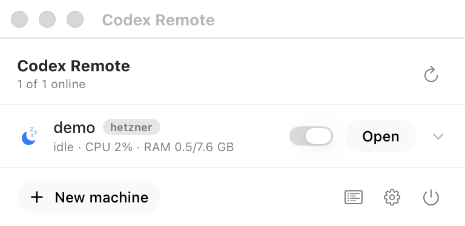

# Codex Remote

As simple as it gets to put Claude or Codex on a remote machine.

```bash
brew install --cask pandelisz/tap/codex-remote
```

Or [download the latest release](https://github.com/PandelisZ/codex-remote/releases/latest).
macOS 15+, Apple silicon or Intel. It lives in the menu bar, not the Dock.

[codexremote.io](https://codexremote.io) · not affiliated with OpenAI or Anthropic.

Give it a cloud provider token. It creates a server with **OpenTofu**, installs **Codex**,
**Claude Code**, or both on it, and wires each one up the way it expects to be reached.
They are reached in opposite directions: the Codex app SSHes out to the machine and starts
`codex app-server` on it, while the machine's Claude Code dials out to your account, so it turns
up on claude.ai/code and on your phone. Your MCP servers come along. Pause it from the menu
bar when you're not using it.

See [docs/agents.md](docs/agents.md) for how the two differ — including why Claude Code
signs in on the machine rather than borrowing this Mac's login.

## Bring your project with you

```bash
codex-remote push my-box          # the current directory
```

Clones when the work is pushed, copies when it is not, and in both cases sends the
untracked `.env` files a clone cannot carry — which is why a clone on its own always leaves
you with a project that does not run. Skips `node_modules` rather than shipping macOS
native modules to Linux. [docs/projects.md](docs/projects.md)

## Let an agent build its own machine

```bash
claude mcp add codex-remote -- codex-remote mcp serve
```

The agent usually knows what it needs better than you do while you are filling in a form.
Connected, it can read your machines; with **Agent access** enabled in Settings it can
create them, run commands on them and sync projects to them. Destroying has its own switch,
because creating the wrong machine costs pence and deleting the right one loses work.
[docs/mcp.md](docs/mcp.md)

## Add a cloud without waiting for a release

The provider catalogue is a JSON file fetched at runtime from
[codexremote.io/registry.json](https://codexremote.io/registry.json) — a cloud is some
OpenTofu HCL, the environment its credentials map onto, and the lists that fill the form.
Point Codex Remote at your own registry for your own providers, including a homelab.
[docs/registry.md](docs/registry.md)

OpenTofu ships inside the app — there is nothing to install — and it is why the provider
list is a list of data files rather than a list of hand-written API clients.



## What happens when you add a machine

1. **Create** — OpenTofu applies a small per-cloud module that makes one server with
   Codex Remote's SSH key on it. Each machine gets its own workspace and state file, so one
   machine can never disturb another's.
2. **Bootstrap over SSH** — base packages, Node, the Codex CLI at `/usr/local/bin/codex`,
   and Claude Code under its own `claude` account. Every unit it installs is enabled, so a
   machine you power off comes back the way you left it.
3. **Register** — a `Host codex-remote-<name>` block written into `~/.ssh/config` itself.
   That is how the Codex app finds a machine: it reads concrete aliases from that file and
   starts `codex app-server` on the host over SSH. The block cannot live behind an
   `Include` — the app parses the file with a library that does not expand them.
4. **Connect** — Codex picks the host up under Connections. Claude Code registers itself and
   appears in your account. Optionally `codex-remote codex-pair <name>` turns on Codex's
   dial-out remote control so the machine is reachable from your phone too.

The whole pipeline above step 1 is provider-agnostic: it only needs an IP and an SSH key.

## Providers

| Provider | What it needs | Pause/resume |
|---|---|---|
| Hetzner Cloud | Project API token (Read & Write) | yes |
| DigitalOcean | Personal access token with write scope | yes |
| Amazon EC2 | IAM access key | yes |
| Linode | Personal access token | not yet |
| Vultr | API key (allow your IP in Vultr's API settings) | not yet |
| Scaleway | Access key, secret key, project id | not yet |
| Existing machine (SSH) | Host, user, key | never — Codex Remote didn't create it |

New machines default to the **newest Ubuntu** each provider offers (26.04 today), and the
name you give a machine becomes its hostname and the name it shows under in both Codex and
Claude.

OpenTofu handles the lifecycle everywhere. Pause and resume need the cloud's own API,
because OpenTofu describes what should *exist*, not whether it is switched on — so it works
on the clouds where Codex Remote also has a native client, and says so plainly on the others.

Adding a cloud is a `TofuModule` — a provider address, some HCL and a credential list — plus
one line in `ProviderRegistry`. See [docs/adding-a-provider.md](docs/adding-a-provider.md).

## Design

The interface follows Apple's macOS 26 guidance: Liquid Glass is confined to the control
layer — the popover's action bar, the primary **Open** action, and window toolbars — and the
machine list and forms stay on standard materials, because Apple's rule is not to put glass
in the content layer. Status is carried by an SF Symbol as well as a colour, never colour
alone. See [docs/design.md](docs/design.md).

## Install

```bash
./Scripts/bundle.sh          # builds build/CodexRemote.app
cp -R build/CodexRemote.app /Applications/
open /Applications/CodexRemote.app
```

A local build is ad-hoc signed by `swift build`, which is all it needs: Gatekeeper only
judges an app that arrives quarantined, and one you built yourself does not. `bundle.sh`
deliberately creates no signing identity of its own — an earlier version did, and its
unauthorised private key raised a keychain dialog on every single rebuild.

Published builds are a different matter: `Scripts/release.sh` signs them with a Developer ID
certificate and notarises them with Apple, because a download that is not notarised is
reported by macOS as *damaged*. See [docs/releasing.md](docs/releasing.md).

## Using it from the terminal

`codex-remote` is the same engine without the GUI — everything the app does is scriptable.

```bash
codex-remote providers                    # what each provider needs
codex-remote account add --provider hetzner --label Hetzner   # reads $HCLOUD_TOKEN
codex-remote capabilities --account Hetzner                   # live regions/sizes/images
codex-remote create --account Hetzner --name codex-eu --region fsn1 --size ccx13
codex-remote adopt --host 203.0.113.9 --user root --name build-box
codex-remote list / status <name> / repair <name> / reconnect <name>
codex-remote up <name> | down <name>      # pause and resume at the provider
codex-remote codex-sync                   # refresh the Codex app's remote list
codex-remote tofu status                  # where the bundled OpenTofu is, and the workspaces
codex-remote tofu validate                # check every module's HCL against its real schema
codex-remote claude-login <name>          # one-off browser sign-in for a machine's Claude Code
codex-remote mcp                          # which MCP servers can travel, and why the rest can't
codex-remote doctor                       # check the local half of the setup
codex-remote rm <name> [--keep-server]   # deletes the server it created, unless told not to
```

Only one process may own the tunnels at a time. If the menu bar app is running it holds
that lock, and `codex-remote` commands that need tunnels say so instead of fighting it for
the same ports.

## The Codex desktop app

Codex Remote writes each ready machine into `~/.codex/.codex-global-state.json` under
`codex-managed-remote-connections`, with the workspace seeded into `remote-projects`.

**Codex reads that file at launch and keeps it in memory.** A machine added while Codex is
running appears after you quit it with ⌘Q and open it again. Codex Remote says so in the menu
bar rather than pretending otherwise, and re-applies its entries if Codex overwrites them.

Entries Codex Remote did not create are never touched, and the first write backs the file up to
`.codex-global-state.json.codex-remote-backup`.

## Where things live

| | |
|---|---|
| `~/.codex-remote/machines.json` | machine registry |
| `~/.codex-remote/bin/` | one launcher per machine, plus `codex-attach` |
| `~/.codex-remote/keys/id_codex-remote` | the key Codex Remote installs on machines it creates |
| `~/.ssh/config.d/codex-remote` | host entries, included from `~/.ssh/config` |
| `~/.codex-remote/tofu/machines/<id>/` | one OpenTofu workspace and state file per machine |
| `~/.codex-remote/tofu/plugin-cache/` | provider plugins, downloaded once and shared |
| login keychain | provider tokens and per-machine app-server tokens |

No token is ever written to a config file, a launcher, a log line, or a command line. Each
launcher pulls its token from the keychain at run time.

## Tests

```bash
swift test                      # 65 unit tests, no network
codex-remote tofu validate         # every module's HCL against its provider's real schema
./Scripts/integration-test.sh   # full pipeline against a throwaway Docker container
```

`tofu validate` is the gate that keeps the clouds honest. Most of them cannot be exercised
live without an account on each, so instead every module's generated HCL is checked against
the provider's own schema — which catches a misspelt attribute or a removed argument
without creating anything or spending anything. It found three real errors the first time
it ran.

The integration test runs the real bootstrap — SSH, apt, the Codex install, systemd, the
tunnel, the token handshake — against a systemd Ubuntu container. It creates no cloud
resources and costs nothing.
